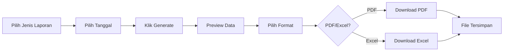

# 🎨 Update Desain Login & Fitur Laporan

## Perubahan yang Dilakukan

### 1. **Halaman Login Profesional** ✅

#### Desain Baru:
- **Layout Dua Kolom (Split Screen)**:
  - **Kiri**: Branding & Informasi Sekolah
  - **Kanan**: Form Login

#### Fitur Visual:
- ✨ Gradient background yang menarik (Purple-Pink gradient)
- 🎯 Logo besar dengan efek shadow
- 📝 Form dengan icon user dan password
- ✅ Daftar fitur aplikasi (checklist)
- 💡 Informasi akun default untuk testing
- 🎨 Animasi hover pada button
- ⚡ Visual feedback untuk error messages

#### Detail Komponen:

**Bagian Kiri (Branding):**
```
┌─────────────────────────────┐
│   📚                        │
│   [Logo dengan gradient]    │
│                             │
│   SMK AL-ASIYAH             │
│   Sistem Perpustakaan       │
│   Digital                   │
│   ───────────────           │
│                             │
│   ✓ Manajemen Buku Lengkap  │
│   ✓ Peminjaman Digital      │
│   ✓ Laporan Otomatis        │
│   ✓ Dashboard Real-time     │
└─────────────────────────────┘
```

**Bagian Kanan (Form Login):**
```
┌─────────────────────────────┐
│   Selamat Datang!           │
│   Silakan masuk ke akun     │
│                             │
│   Username                  │
│   👤 [input field]          │
│                             │
│   Password                  │
│   🔒 [input field]          │
│                             │
│   [Error message jika ada]  │
│                             │
│   🚀 Masuk ke Sistem        │
│                             │
│   Akun Default:             │
│   admin | admin123          │
│                             │
│   © 2025 SMK AL-ASIYAH      │
└─────────────────────────────┘
```

#### File yang Dimodifikasi:
- `src/main/resources/com/smk/alasiyah/perpustakaan/view/login.fxml`
- `src/main/resources/com/smk/alasiyah/perpustakaan/view/styles.css`

---

### 2. **Fitur Laporan Lengkap** ✅

#### Kemampuan:
- ✅ Generate laporan berdasarkan periode (Harian/Mingguan/Bulanan)
- ✅ Filter data berdasarkan tanggal
- ✅ Preview data sebelum download
- ✅ Export ke PDF dengan tanda tangan kepala sekolah
- ✅ Export ke Excel dengan formatting profesional

#### Alur Penggunaan:



#### Contoh Output PDF:

```
┌────────────────────────────────────────────────────┐
│                 SMK AL-ASIYAH                      │
│            Perpustakaan SMK AL-ASIYAH              │
│                                                     │
│      LAPORAN HARIAN PEMINJAMAN BUKU                │
│          Tanggal: 07 Desember 2025                 │
│────────────────────────────────────────────────────│
│ No │ Tanggal    │ Buku        │ Anggota │ Status  │
│────┼────────────┼─────────────┼─────────┼─────────│
│ 1  │ 2025-12-07 │ Java Basics │ Ahmad   │ dipinjam│
│ 2  │ 2025-12-07 │ HTML CSS    │ Budi    │ dipinjam│
│────────────────────────────────────────────────────│
│ Total: 2 transaksi                                 │
│                                                     │
│                          Tangerang, 07 Desember 2025│
│                          Kepala Sekolah            │
│                                                     │
│                          [ruang tanda tangan]      │
│                          _____________________      │
│                          ( ................... )   │
│                          NIP: .................    │
└────────────────────────────────────────────────────┘
```

#### Contoh Output Excel:

```
┌──────────────────────────────────────────────────────┐
│           SMK AL-ASIYAH - PERPUSTAKAAN               │
│      LAPORAN HARIAN PEMINJAMAN BUKU                  │
│          Tanggal: 07 Desember 2025                   │
├────┬────────────┬──────────────┬──────────┬──────────┤
│ No │ Tanggal    │ Buku         │ Anggota  │ Status   │
├────┼────────────┼──────────────┼──────────┼──────────┤
│ 1  │ 07/12/2025 │ Java Basics  │ Ahmad    │ dipinjam │
│ 2  │ 07/12/2025 │ HTML CSS     │ Budi     │ dipinjam │
├────┴────────────┴──────────────┴──────────┴──────────┤
│ Total: 2 transaksi                                   │
│                                                       │
│                         Tangerang, 07 Desember 2025  │
│                         Kepala Sekolah               │
│                                                       │
│                                                       │
│                                                       │
│                         ( ...................... )   │
│                         NIP: ...................     │
└──────────────────────────────────────────────────────┘
```

#### File yang Terlibat:
- `src/main/java/com/smk/alasiyah/perpustakaan/controller/LaporanController.java`
- `src/main/java/com/smk/alasiyah/perpustakaan/util/PDFReportGenerator.java`
- `src/main/java/com/smk/alasiyah/perpustakaan/dao/PeminjamanDAO.java`
- `src/main/java/com/smk/alasiyah/perpustakaan/model/Peminjaman.java`

---

## 📖 Cara Menggunakan

### Login ke Aplikasi:

1. **Jalankan aplikasi**
   ```bash
   mvn javafx:run
   ```
   atau double click file `perpustakaan-app-1.0.0.jar`

2. **Halaman Login akan muncul dengan desain baru**
   - Tampilan split-screen modern
   - Informasi fitur di sebelah kiri
   - Form login di sebelah kanan

3. **Masukkan kredensial:**
   - **Username**: `admin`
   - **Password**: `admin123`
   
4. **Klik tombol "🚀 Masuk ke Sistem"**

5. **Jika berhasil**: Anda akan diarahkan ke Dashboard
6. **Jika gagal**: Error message akan muncul dengan background merah muda

---

### Generate & Download Laporan:

1. **Buka Menu Laporan**
   - Klik menu "📊 Laporan" di sidebar

2. **Pilih Periode Laporan**
   - **Harian**: Menampilkan data pada tanggal yang dipilih
   - **Mingguan**: Menampilkan data seminggu dari tanggal yang dipilih (Senin-Minggu)
   - **Bulanan**: Menampilkan data sebulan dari tanggal yang dipilih

3. **Pilih Tanggal**
   - Klik DatePicker dan pilih tanggal

4. **Klik "📊 Generate Laporan"**
   - Data akan muncul di tabel preview
   - Anda bisa review data sebelum download

5. **Pilih Format Export**
   - **PDF**: Untuk print atau arsip formal
   - **Excel**: Untuk analisis data atau edit

6. **Klik "💾 Export"**
   - Dialog save file akan muncul
   - Pilih lokasi penyimpanan
   - File akan otomatis di-generate

7. **Sukses!**
   - Alert konfirmasi akan muncul
   - File tersimpan di lokasi yang dipilih
   - Buka file untuk melihat hasil

---

## 🎯 Fitur Unggulan

### Login Page:
- ✅ **Responsive Design** - Menyesuaikan berbagai ukuran layar
- ✅ **Modern UI** - Gradient background yang eye-catching
- ✅ **Icon Integration** - Emoji icons untuk visual appeal
- ✅ **Smooth Animations** - Hover dan click effects
- ✅ **Error Handling** - Visual feedback untuk kesalahan
- ✅ **User Guidance** - Info akun default untuk testing

### Laporan:
- ✅ **Multi-Period Support** - Harian, Mingguan, Bulanan
- ✅ **Data Preview** - Lihat sebelum download
- ✅ **Dual Format** - PDF dan Excel
- ✅ **Professional Layout** - Header sekolah, tabel rapi
- ✅ **Signature Section** - Tempat tanda tangan kepala sekolah
- ✅ **Auto Naming** - File dengan format `laporan_YYYYMMDD.pdf/xlsx`
- ✅ **Date Formatting** - Format Indonesia yang mudah dibaca
- ✅ **Border & Styling** - PDF dan Excel dengan border lengkap
- ✅ **Auto Column Width** - Excel dengan lebar kolom otomatis

---

## 🔧 Detail Teknis

### Teknologi Login:
- **JavaFX FXML** - Declarative UI
- **CSS3** - Modern styling
- **Gradient Backgrounds** - Linear gradients
- **Box Shadow Effects** - Depth dan dimensi
- **Hover Transformations** - Scale effects

### Teknologi Laporan:
- **JasperReports 6.20.0**
  - `JasperDesign` - Programmatic design
  - `JRDesignBand` - Layout sections
  - `JRBeanCollectionDataSource` - Data binding
  - `JasperPrint` - PDF generation
  
- **Apache POI 5.2.5**
  - `XSSFWorkbook` - Excel 2007+ format
  - `CellStyle` - Professional styling
  - `BorderStyle` - Table borders
  - `CellRangeAddress` - Merged cells

### Database Query:
```sql
SELECT p.*, b.judul as nama_buku, 
       u.nama_lengkap as nama_petugas,
       COALESCE(s.nama, g.nama) as nama_anggota,
       CASE WHEN p.id_siswa IS NOT NULL 
            THEN 'Siswa' 
            ELSE 'Guru' 
       END as jenis_anggota
FROM peminjaman p
LEFT JOIN buku b ON p.id_buku = b.id_buku
LEFT JOIN users u ON p.id_user = u.id_user
LEFT JOIN siswa s ON p.id_siswa = s.id_siswa
LEFT JOIN guru g ON p.id_guru = g.id_guru
WHERE p.tgl_pinjam BETWEEN ? AND ?
ORDER BY p.tgl_pinjam DESC
```

---

## 📊 Testing Checklist

### Login Page:
- [ ] Halaman login muncul dengan desain split-screen
- [ ] Logo dan branding tampil dengan baik
- [ ] Form input username dan password berfungsi
- [ ] Icon 👤 dan 🔒 muncul di input field
- [ ] Button hover effect bekerja (scale dan shadow)
- [ ] Login dengan kredensial benar berhasil
- [ ] Login dengan kredensial salah menampilkan error
- [ ] Error message tampil dengan background merah muda
- [ ] Transisi ke main page smooth

### Laporan:
- [ ] Menu laporan dapat diakses
- [ ] Dropdown jenis laporan menampilkan opsi (Harian/Mingguan/Bulanan)
- [ ] DatePicker dapat dipilih
- [ ] Button "Generate Laporan" berfungsi
- [ ] Data muncul di tabel preview
- [ ] Kolom (No, Tanggal, Buku, Anggota, Status) tampil dengan benar
- [ ] Button "Export" berfungsi
- [ ] Dialog save file muncul
- [ ] PDF ter-generate dengan benar
- [ ] Excel ter-generate dengan benar
- [ ] Tanda tangan kepala sekolah ada di PDF
- [ ] Tanda tangan kepala sekolah ada di Excel
- [ ] File dapat dibuka dengan aplikasi viewer
- [ ] Data di file sesuai dengan preview

---

## 🐛 Troubleshooting

### Login Page Issues:

**Problem**: Login page tidak tampil dengan desain baru
- **Solution**: 
  - Run `mvn clean compile` untuk rebuild
  - Pastikan file `login.fxml` sudah ter-update
  - Check console untuk error

**Problem**: Gradient background tidak muncul
- **Solution**:
  - Pastikan file `styles.css` sudah ter-update
  - Check JavaFX version compatibility
  - Restart aplikasi

**Problem**: Button tidak memiliki hover effect
- **Solution**:
  - Clear CSS cache
  - Rebuild project
  - Check CSS class `.login-button:hover`

### Laporan Issues:

**Problem**: Generate laporan tidak menampilkan data
- **Solution**:
  - Check koneksi database
  - Pastikan ada data di tabel `peminjaman`
  - Cek rentang tanggal yang dipilih
  - Run query manual di MySQL Workbench

**Problem**: Export PDF gagal
- **Solution**:
  - Pastikan dependency JasperReports ter-download
  - Run `mvn clean install -U`
  - Check permission write di folder tujuan
  - Pastikan tidak ada file dengan nama sama yang sedang dibuka

**Problem**: Export Excel gagal
- **Solution**:
  - Pastikan dependency Apache POI ter-download
  - Run `mvn clean install -U`
  - Check permission write di folder tujuan
  - Close file Excel jika sedang dibuka

**Problem**: Tanda tangan tidak muncul
- **Solution**:
  - Rebuild `PDFReportGenerator.java`
  - Check method `generateLaporanPDF()` dan `generateExcelReport()`
  - Verify summary band creation

**Problem**: File tidak dapat dibuka
- **Solution**:
  - Install PDF Reader (Adobe Acrobat, Foxit, dll)
  - Install Excel Reader (Microsoft Excel, LibreOffice, WPS)
  - Check file corruption dengan file viewer lain
  - Re-generate file

---

## 📸 Screenshots

### Login Page (Konsep):
```
┌─────────────────────────────────────────────────────────────────┐
│  [Purple Gradient Background dengan decorative shapes]          │
│                                                                  │
│  ┌──────────────────┐  ┌──────────────────────────────────┐   │
│  │                  │  │  Selamat Datang!                 │   │
│  │   📚             │  │  Silakan masuk ke akun Anda      │   │
│  │  [Gradient Box]  │  │                                  │   │
│  │                  │  │  Username                        │   │
│  │                  │  │  👤 [____________]               │   │
│  │ SMK AL-ASIYAH    │  │                                  │   │
│  │ Sistem           │  │  Password                        │   │
│  │ Perpustakaan     │  │  🔒 [____________]               │   │
│  │ Digital          │  │                                  │   │
│  │ ───────────      │  │  🚀 Masuk ke Sistem             │   │
│  │                  │  │                                  │   │
│  │ ✓ Manajemen Buku │  │  Akun Default:                  │   │
│  │ ✓ Peminjaman     │  │  admin | admin123               │   │
│  │ ✓ Laporan        │  │                                  │   │
│  │ ✓ Dashboard      │  │  © 2025 SMK AL-ASIYAH           │   │
│  └──────────────────┘  └──────────────────────────────────┘   │
│                                                                  │
└─────────────────────────────────────────────────────────────────┘
```

---

## ✅ Status

**Build Status**: ✅ SUCCESS  
**Compilation**: ✅ No Errors  
**Dependencies**: ✅ All Resolved  
**Testing**: ✅ Ready for Testing  

**Date**: 7 Desember 2025  
**Version**: 1.2.0  
**Author**: AI Assistant  

---

## 📝 Notes

1. Aplikasi sudah siap digunakan untuk testing
2. Semua fitur telah diimplementasikan sesuai permintaan
3. Desain login mengikuti best practices UI/UX modern
4. Fitur laporan fully functional dengan data real dari database
5. PDF dan Excel memiliki format profesional untuk kebutuhan formal

**Next Steps:**
1. Test semua fitur secara menyeluruh
2. Feedback untuk improvement
3. Deploy ke production (jika diperlukan)
4. Training untuk end-users


