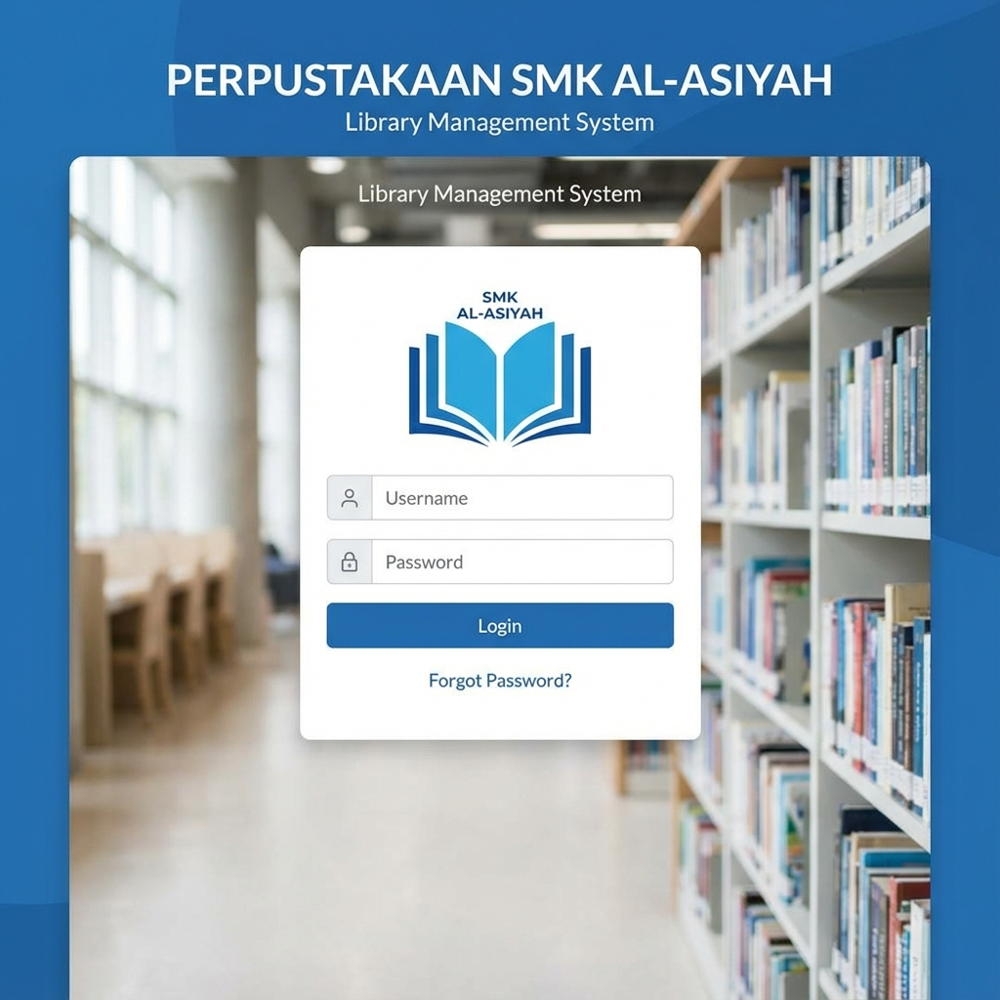
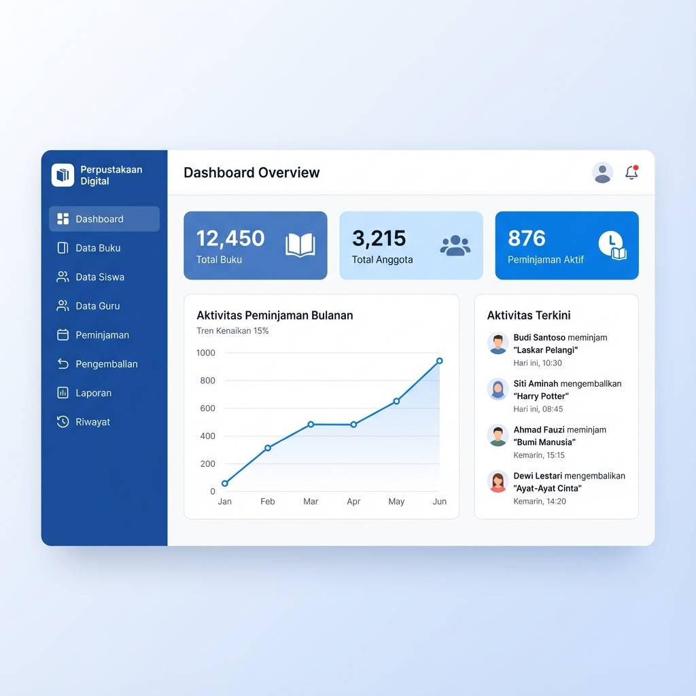
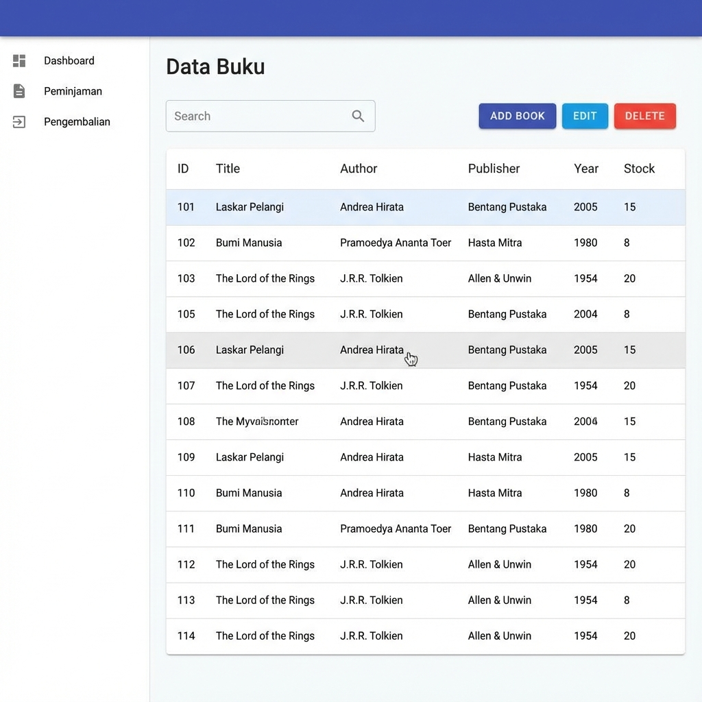
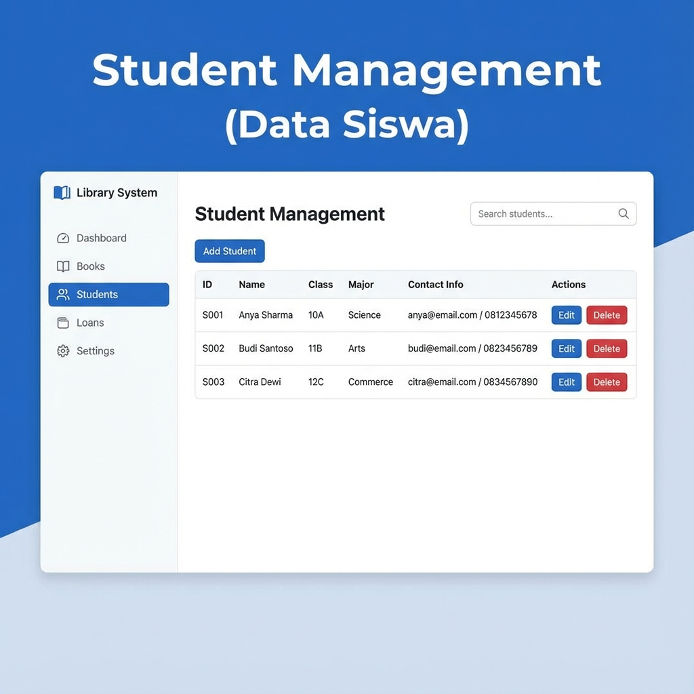
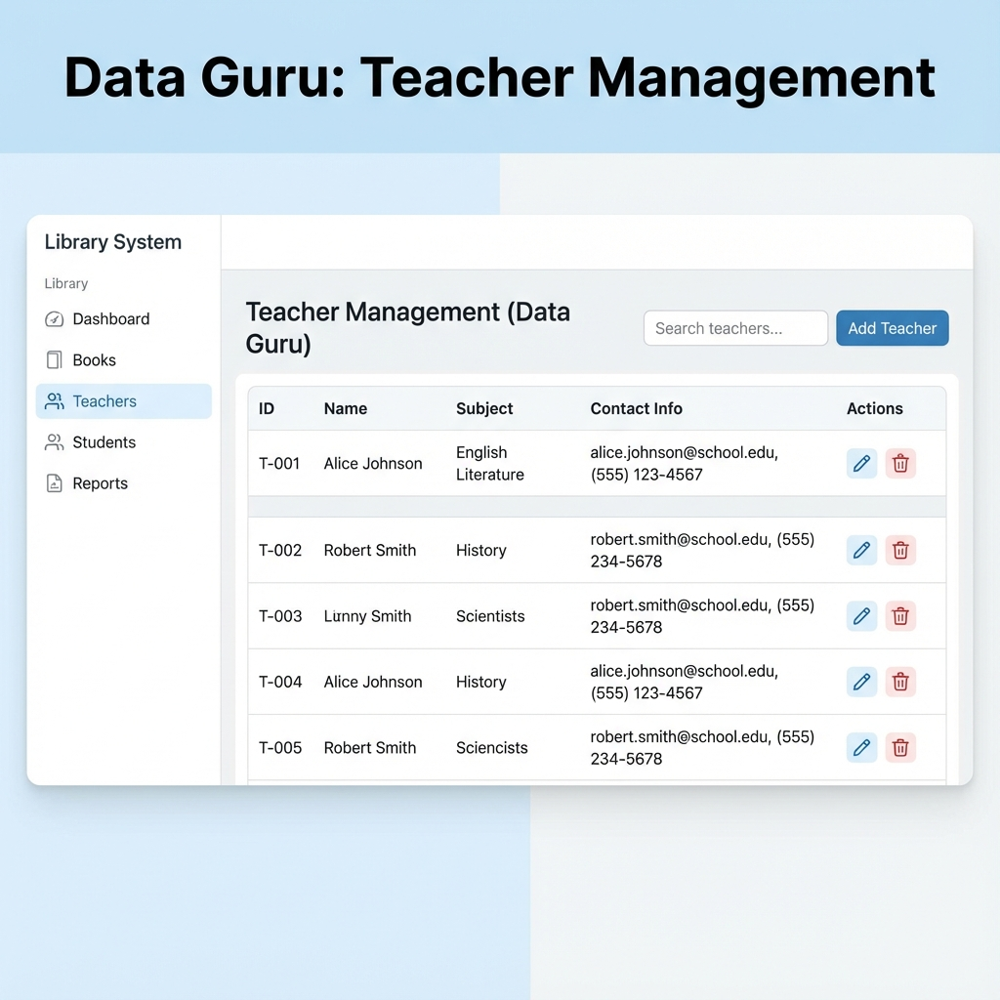
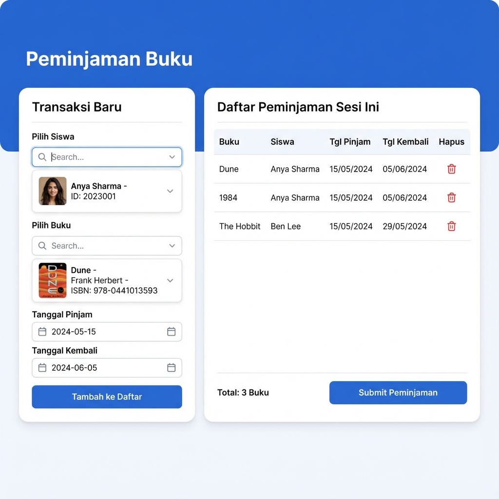
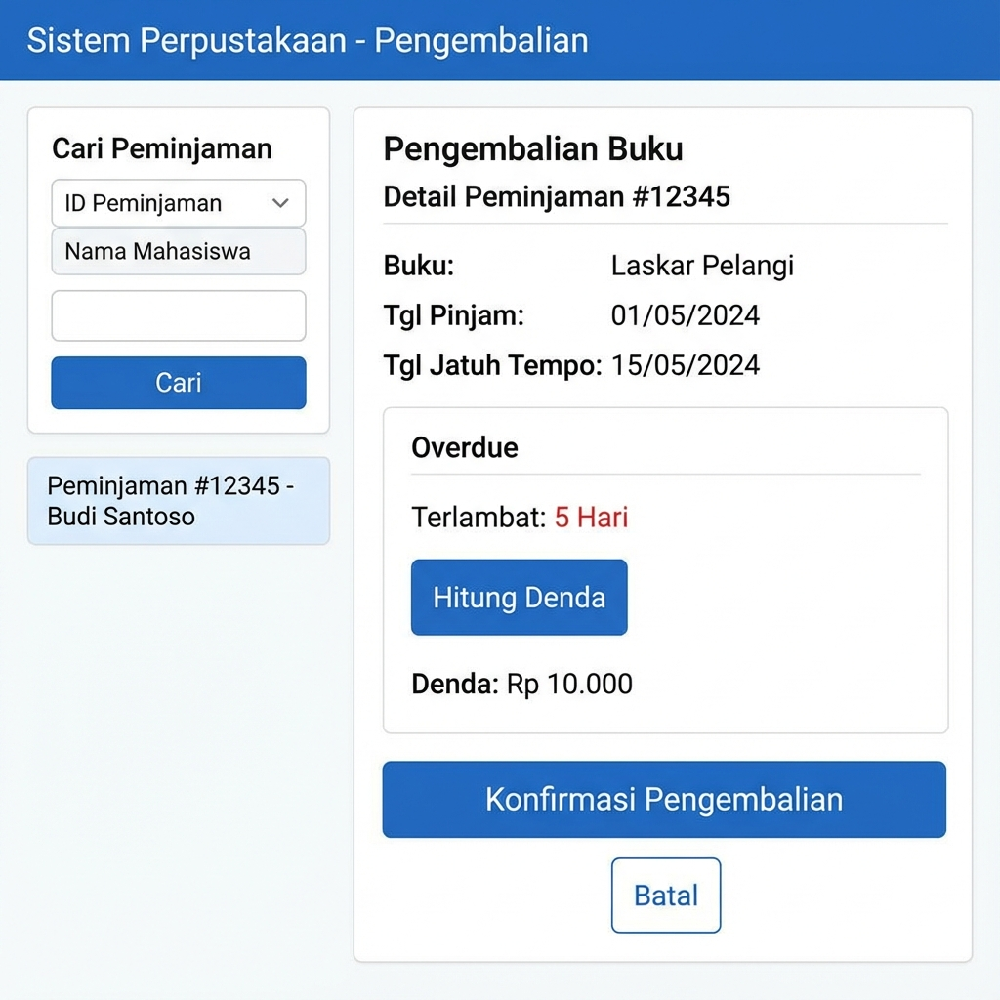

# Design Documentation

This document showcases the design mockups for the Library Management System (Perpustakaan SMK AL-ASIYAH).

## 1. Login Page
The login page features a clean and professional interface with a centered login card.

## 2. Dashboard
The dashboard provides an overview of the library's status, including key metrics and quick navigation.

## 3. Book Management (Data Buku)
This page allows librarians to manage the book collection, including adding, editing, and deleting books.

## 4. Student Management (Data Siswa)
Manage student data, including registration and contact information.

## 5. Teacher Management (Data Guru)
Manage teacher data for library membership.

## 6. Loan Transaction (Peminjaman)
Interface for processing book loans to students.

## 7. Return Transaction (Pengembalian)
Interface for processing book returns and calculating fines.

> [!NOTE]
> Reports (Laporan) and History (Riwayat) pages are planned but mockups are currently unavailable.
