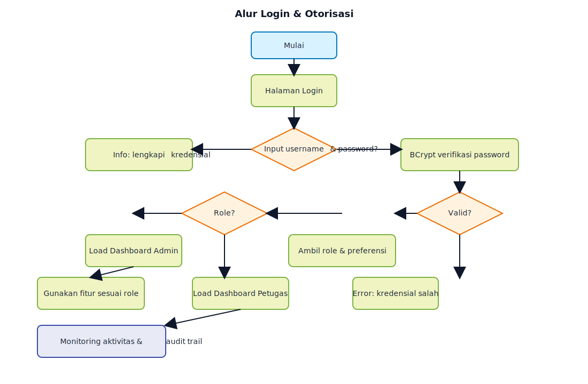
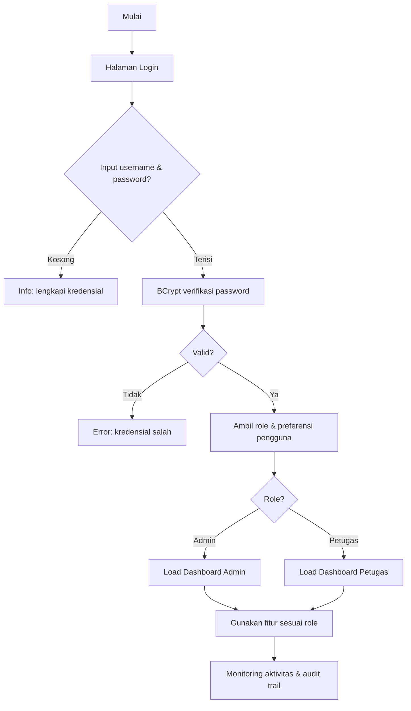
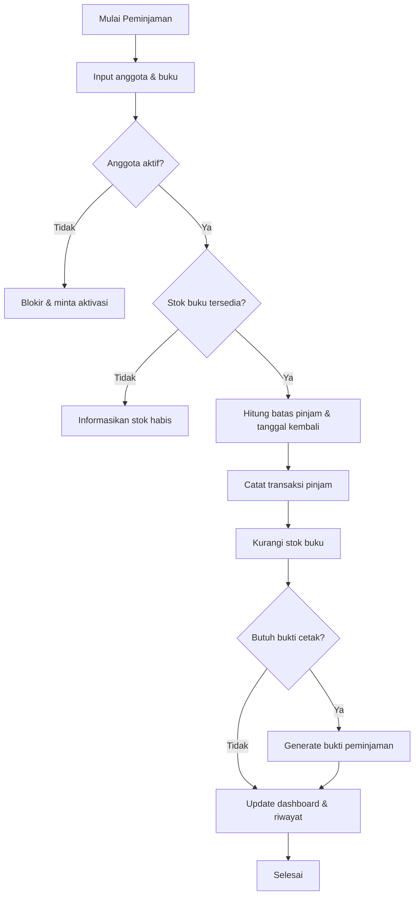
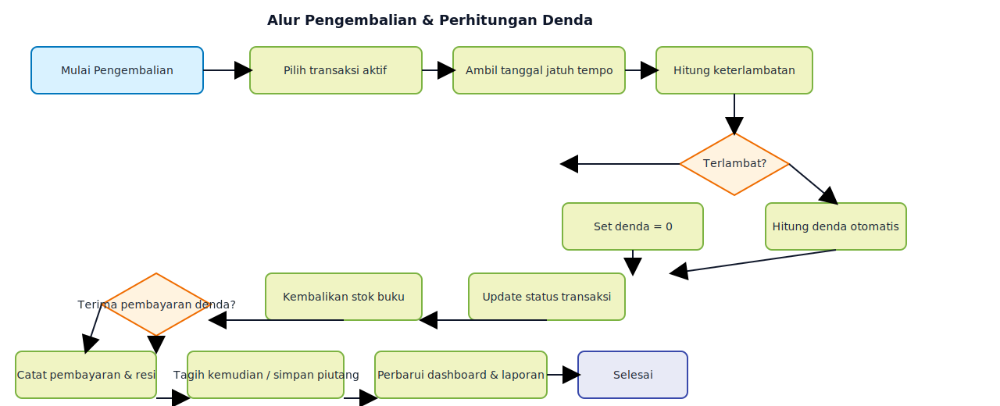
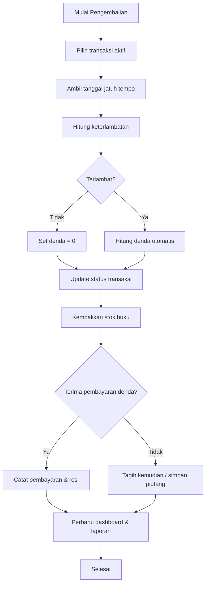
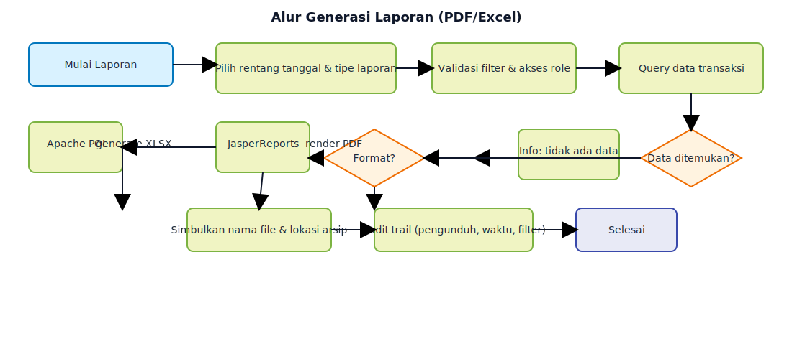

# 🗺️ Flowchart Sistem - Aplikasi Perpustakaan

Dokumen ini menyajikan alur proses utama secara detail untuk memastikan tim pengembang, QA, dan operasional memiliki referensi visual yang jelas.

## 1) Alur Login & Otorisasi




## 2) Alur Peminjaman Buku




## 3) Alur Pengembalian & Perhitungan Denda




## 4) Alur Generasi Laporan (PDF/Excel)


```mermaid
flowchart TD
    A[Mulai Laporan] --> B[Pilih rentang tanggal & tipe laporan]
    B --> C[Validasi filter & akses role]
    C --> D[Query data transaksi]
    D --> E{Data ditemukan?}
    E -- Tidak --> X1[Info: tidak ada data]
    E -- Ya --> F{Format?}
    F -- PDF --> G[JasperReports render PDF]
    F -- Excel --> H[Apache POI generate XLSX]
    G --> I[Simbolkan nama file & lokasi arsip]
    H --> I
    I --> J[Audit trail (pengunduh, waktu, filter)]
    J --> Z[Selesai]
```

## Catatan Implementasi
- **Validasi stok & status anggota** berada di layer service untuk menjaga integritas data sebelum akses database.
- **Perhitungan denda** menggunakan tanggal server agar konsisten dan anti-manipulasi waktu klien.
- **Audit trail** disarankan untuk login, generate laporan, dan transaksi pembayaran denda.
- **Cetak bukti** opsional namun direkomendasikan untuk transaksi fisik (tersimpan juga sebagai arsip digital).
